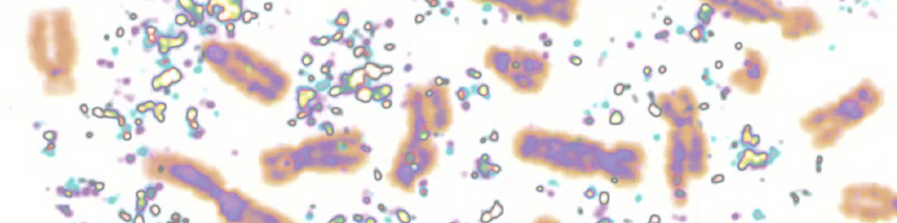

# BI402 Senior Seminar

## Section B - Chromosome Chaos: Variation, Disorder, and Evolution in the Genome

**Colby College  -  Spring 2026  -  Syllabus**

#### Meeting times

Fridays 1-1:50 pm, in [Gordon 270](https://map.colby.edu/)

#### Instructor

[Dr. David R. Angelini](https://www.colby.edu/people/people-directory/dave-angelini/) 

e-mail: [dave.angelini@colby.edu](mailto:dave.angelini@colby.edu)

Office hours: Mondays 3:00 - 4:00 pm, Fridays 11:00 am - 12:00 pm, or by appointment

### Prerequisites

Biology major senior standing, or instructor authorization.

### Learning Objectives

The Biology Senior Seminar explores and models different modes of communication used in professional biological science. Through this course students will 

1. read the current primary biological literature, 
2. present and discuss papers with their peers, and
3. experience the presentations of invited guest speaker.

Chromosomes are often depicted as static libraries, yet they are dynamic, fragile, and often selfish entities. This senior seminar explores the "chaos" of genomic architecture, ranging from cancer-associated chromothripsis and parasitic B-chromosomes to the evolution of adaptive supergenes and novel sex determination systems. Through an exploration of the current primary literature and student-led discussions, we will investigate how chromosomal instability drives both disease and evolution.

### Discussion Guidelines

The basis of this class is the discussion of published papers, led by students. During the second class, we will decide as a group on the papers to be read and on who will lead each discussion. Student leaders are intended to direct the discussions, not to do all the talking. In fact, I might expect the discussion leaders to do the least amount of talking during a good discussion. [Discussion leaders](rubric.for.discussion.leaders.md) will be responsible for reading the [Discussion Preparation Worksheets](literature.discussion.worksheet.md) from the rest of the students, and assuring that students present their most interesting ideas to the rest of the class during the discussion. To facilitate these discussions, specific responsibilities are outlined below.

- Ahead of a Friday literature discussion, each student must submit a [Discussion Preparation Worksheet](literature.discussion.worksheet.md) to the discussion leaders by Wednesday at noon (that is, 48 hours before the paper will be discussed). Discussion leaders do not need to complete a Discussion Preparation sheet. 
- Discussion Leaders will use the Worksheets and the [Rubric for Discussion Leaders](rubric.for.discussion.leaders.md) to help guide the discussion. 

This course seeks to build a more antiracist community. While it is not the focus of our subject, discussions may raise issues of racism, colonialism, sexism, and other forms of interpersonal discrimination in the past and present. It is my hope that these conversations, while potentially uncomfortable, will be embraced with respect, compassion and mindful reflection. At any time, if anyone feels that any comments in discussion, any readings or any structures of the course treat these subjects inappropriately, that critique is welcomed, openly or privately. 

### Visiting Speakers

A tradition in science is that when researchers publish exciting results, they may be invited to other institutions to share their findings and interpretations with a public audience. This semester, Colby will host several invited speakers. You will be expected to participate in these events as a part of BI402. In preparation, you will be expected to read an article by the speaker. You are also asked to engage with the speakers by asking a question at their presentation, or by joining speakers for informal conversations either at lunch before the presentation or social time afterward.

### Assessments

The seminar course will use the assessment approach known as **ungrading**. This approach will still assign a letter grade for the course at the end of the semester. However, instead of awarding points for individual assignments throughout the semester, you will be assessed holistically and in real time. Your completion of  the basic course tasks, such as attendance and leading discussion is expected. Anything less is a significant failure to meet the expectations of the course. (That said, there are acceptable reasons to miss a Friday's class, but clear communication is necessary and that responsibility rests with you.) Participation in weekly discussions is the major component upon which your grade will be based. I expect all students to prepare (by reading the paper and completing the discussion worksheet) and to contribute to group discussion. Compared to traditional grading systems, ungrading can be liberating, but may also mean students are uncertain about their standing. I am happy to provide constructive, descriptive feedback on anyone's performance at any time. 

### Learning management platform (Moodle)

Moodle ( http://moodle.colby.edu/ ) will be my primary method for communicating materials and announcements to you outside of class. There you will also find links to the course [syllabus](https://github.com/aphanotus/openEd/blob/main/BI164.Evolution.and.Diversity/README.md) and the schedule of topics, assignments, and PDF files from lecture slides. 

### Access and Support

First, please speak with me early if you are having trouble in the course.

  
<b>Additional support services</b>

  <ul>
    <li><a href="http://www.colby.edu/counseling/">Counseling Services</a> (207-859-4490) provided from the Health Center offer professional, confidential consultations regarding family problems, stress, depression, cultural adjustments, concerns with sexuality, alcohol and drug use, trauma and other personal issues.
    <li><a href="mailto:deanofstudies@colby.edu">Class Deans</a> can guide students through a range of issues. Students can reach out to their class dean via email or by calling x4560. They are also welcome to visit the Dean of Studies Office in Eustis 107 for assistance with scheduling or other inquiries. 
    <li>If you encounter barriers to your full participation in this course, please let me know immediately so we can determine if there is an accommodation that can be made. If you are a student with a disability, or think you may have a disability, the <a href="https://www.colby.edu/studentadvising/student-access-and-disability-services/">Dean of Students Office</a> works with students and faculty to identify reasonable accommodations. 
    <li>The <a href="http://web.colby.edu/farnham-writerscenter/">Farnham Writing Center</a> offers support for students on basic writing and reading skills.
    <li><a href="https://davisconnects.colby.edu/">DavisConnects</a> helps students  explore internship, career, and study abroad opportunities. <a href="https://colby.joinhandshake.com/login">Make an appointment</a> with an advisor through the Handshake portal.
  </ul>

### Sustainability 

Environmental degradation is a serious biological and societal issue. [Colby](https://www.colby.edu/green-colby/) is committed to practices that promote environmental sustainability. To help minimize the environmental impact of this course, I encourage you to buy used textbooks. Minimize paper use by reading slides on a device when possible, rather than printing on paper. It is acceptable to take notes on a laptop or tablet during class. If you choose to print, please print double-sided on recycled paper. Multiple slides may be printed to a single sheet. Recycle unnecessary paper after the end of the semester.

### Academic Integrity 

Honesty, integrity, and personal responsibility are cornerstones of a Colby education and provide the foundation for scholarly inquiry, intellectual discourse, and an open and welcoming campus community. [These values](https://www.colby.edu/academics/academic-integrity/) are central to this course. You are expected to demonstrate academic honesty in all aspects of this course. Academic dishonesty includes, but is not limited to: [plagiarism](https://libguides.colby.edu/avoidingplagiarism) (which includes paraphrasing from sources, even with a citation); claiming the work of another person or [AI](https://www.edweek.org/technology/new-data-reveal-how-many-students-are-using-ai-to-cheat/2024/04) as your own; buying or attempting to buy papers or other assignments; fabricating information or citations; knowingly assisting others in acts of academic dishonesty; violating clearly stated rules for taking an exam; misrepresentations to faculty within the context of a course; and submitting the same work, including an essay that you wrote, in more than one course. Sanctions for academic dishonesty are assigned by an [academic review board](https://www.colby.edu/wp-content/uploads/2021/01/StudentAcadDishFlowChart-7.pdf) and may include failure on the assignment, failure in the course, suspension or expulsion from the College.

### Sexual Misconduct

Colby College prohibits [sexual misconduct or gender based discrimination](https://life.colby.edu/your-safety/sexual-violence-title-ix/title-ix-policy-guidance/) and is obligated, by federal and state laws, to respond to reports and provide resources to students. As your professor I am considered a "responsible employee" which requires me to report incidence of sexual assault, sexual harassment, dating violence, or stalking to the [Title IX Coordinator](https://life.colby.edu/your-safety/sexual-violence-title-ix/meet-the-staff/). 

  
<b>Confidential support services</b>

  <ul>
    <li><a href="http://www.colby.edu/counseling/">Counseling Services</a> (207-859-4490) 
    <li><a href="https://life.colby.edu/your-safety/sexual-violence-title-ix/meet-the-staff/">Title IX Confidential Advocate</a> (207-509-9122) 
    <li><a href="https://life.colby.edu/what-to-do/spiritual-life/">Office of Religious and Spiritual Life</a> (207-859-4272 )
    <li><a href="https://www.mecasa.org/">Maine Coalition Against Sexual Assault</a> (24/7 helpline: 1-800-871-7741)
  </ul>

### Accommodations for public health

If you experience symptoms of a contagious respiratory illness, such as [covid-19](https://www.cdc.gov/covid/signs-symptoms/) or [flu](https://www.cdc.gov/flu/signs-symptoms/index.html), please only attend class if you wear a [KN-95](https://www.cdc.gov/respiratory-viruses/prevention/masks.html) face mask or similar design.

### Schedule

|    date     | activity                                                     |
| :---------: | :----------------------------------------------------------- |
| February 6  | Introductions                                                |
| February 13 | Selection of articles for discussion                         |
| February 20 | Student-led discussion                                       |
| February 27 | Student-led discussion                                       |
|   March 6   | Visiting speaker: [April Horton](https://www.google.com/url?q=https://www.bates.edu/faculty/profile/april-l-horton/&source=gmail-imap&ust=1770143594000000&usg=AOvVaw0NsYFt_AYogd_1hcgqB8Kj), Bates College; Topic: Genetics and evolution of animal development and symbioses; Host: Suegene Noh |
|  March 13   | Student-led discussion                                       |
|  March 20   | Student-led discussion                                       |
|   April 3   | Visiting speaker: [Jennifer McCarthy-Taylor](https://www.google.com/url?q=https://www.albertinlab.org/lab&source=gmail-imap&ust=1770143594000000&usg=AOvVaw2mS-FxvObL8MO4VmgOQd9z), Marine Biological Laboratory (Albertin Lab); Topic: Body-patterning in cephalopod development; Host: Christina Cota |
|  April 10   | Student-led discussion                                       |
|  April 17   | Student-led discussion                                       |
|  April 24   | Visiting speaker: [Courtney Clark-Hachtel](https://go.unca.edu/faculty/dr-courtney-clark-hachtel/), University of North Carolina Asheville; Topic: Genome stability mechanisms in tardigrades; Host: Dave Angelini |
|    May 8    | Concluding group discussion                                  |

### 
